# computer-graphics

Here is the program that I wrote during the Computer Graphics class in 2006.

1. Line drawing
    1. [Bresenham's line algorithm](#1-bresenhams-line-algorithm)
    2. [Line caps and hatching](#2-line-caps-and-hatching)
2. Polygon drawing
    1. [Polygon stroking and filling](#3-polygon-stroking-and-filling)
    2. [Even-odd vs. non-zero winding rules](#4-even-odd-vs-non-zero-winding-rules)
3. Clipping
    1. [Cyrus-Beck algorithm](#5-cyrus-beck-algorithm)
    2. [Sutherland-Hodgman algorithm](#6-sutherland-hodgman-algorithm)
4. Curve drawing
    1. [Quadratic and cubic Bezier curves](#7-quadratic-and-cubic-bezier-curves)
    2. [Composite Bezier curve](#8-composite-bezier-curve)
    3. [Bezier curves of degree 4 and 5](#9-bezier-curves-of-degree-4-and-5)
    4. [Cubic B-spline curve](#10-cubic-b-spline-curve)
5. 3D drawing and clipping
    1. [Parallel projection](#11-parallel-projection)
    2. [Perspective projection with hidden line removal](#12-perspective-projection-with-hidden-line-removal)
    3. [Animation](#13-animation)
    4. [Line clipping by a cone](#14-line-clipping-by-a-cone)

---
## 1. Bresenham's line algorithm
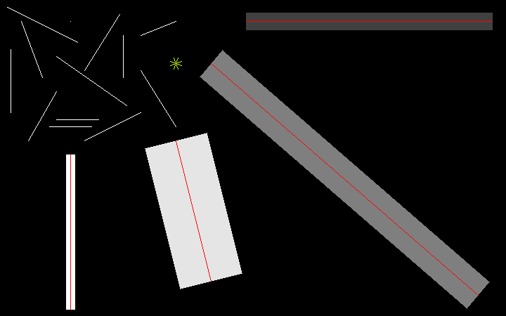

---
## 2. Line caps and hatching
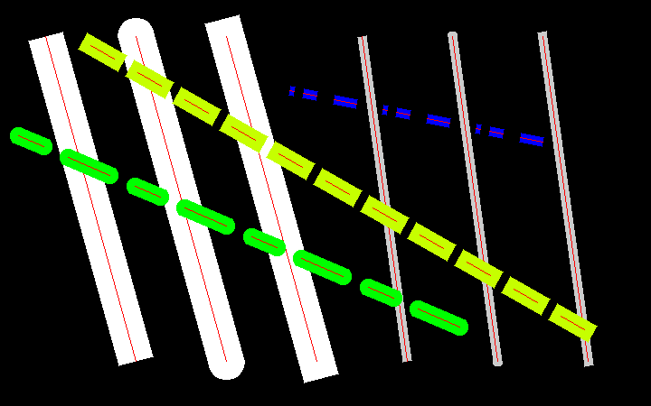

---
## 3. Polygon stroking and filling
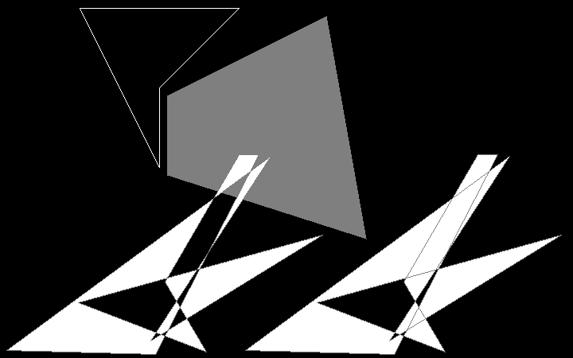

---
## 4. Even-odd vs. non-zero winding rules
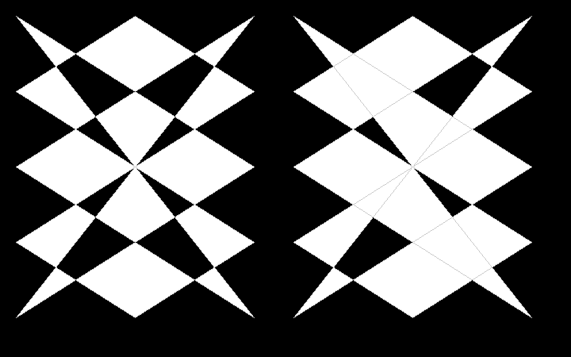

---
## 5. Cyrus-Beck algorithm
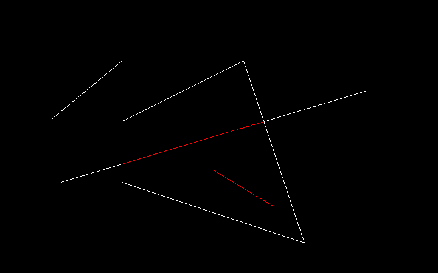

---
## 6. Sutherland-Hodgman algorithm
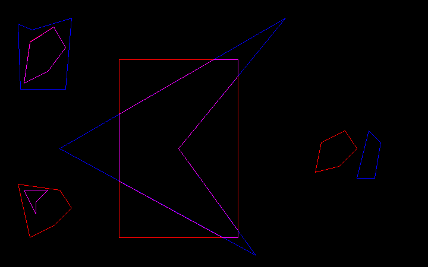

---
## 7. Quadratic and cubic Bezier curves
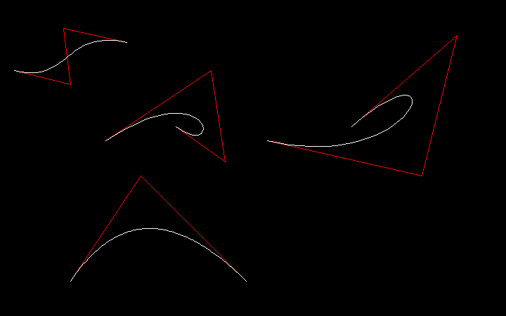

---
## 8. Composite Bezier curve
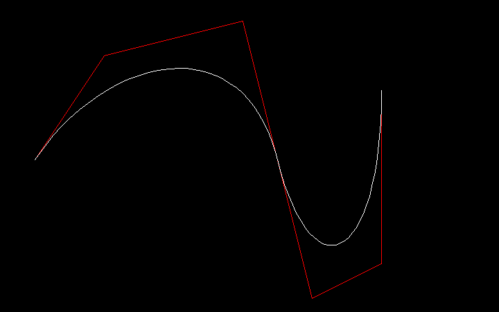

---
## 9. Bezier curves of degree 4 and 5
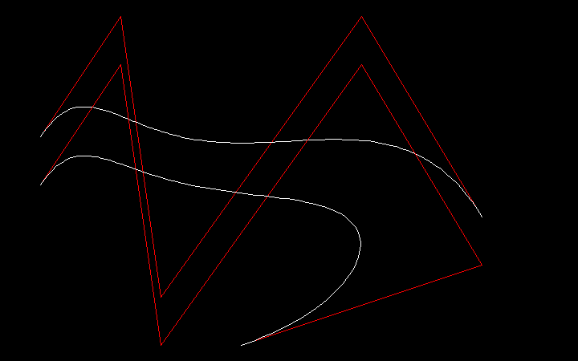

---
## 10. Cubic B-spline curve
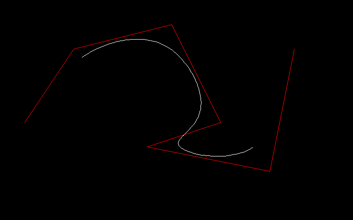

---
## 11. Parallel projection
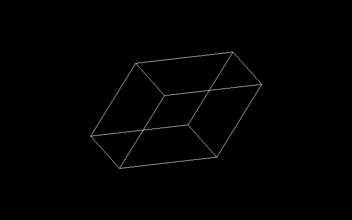

---
## 12. Perspective projection with hidden line removal
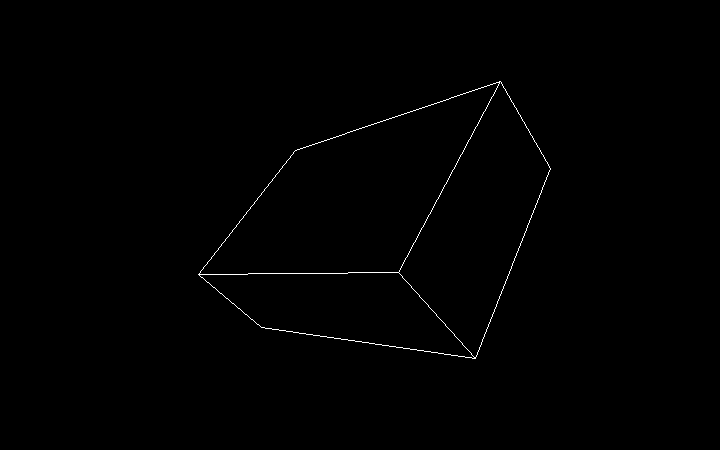

---
## 13. Animation
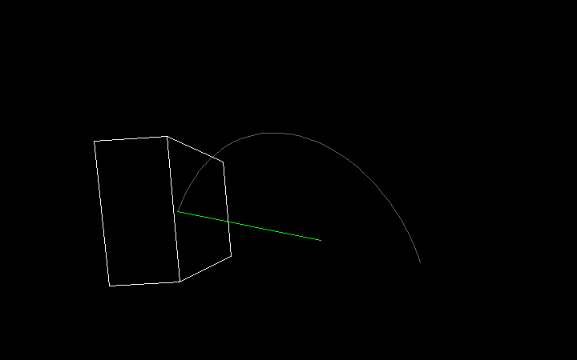

---
## 14. Line clipping by a cone
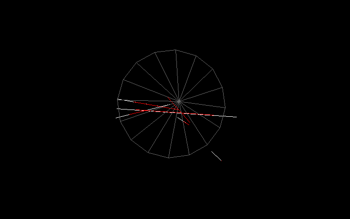

